<h1 align="center">AEGIS Mini-SOC</h1>

<p align="center">
  <strong>Un détecteur d'intrusion réseau qui apprend ce qu'est la normale,<br>
  et le poste d'analyste qui rend ses alertes exploitables.</strong><br>
  Il n'attend pas la signature d'une attaque connue : il remarque ce qui s'écarte,<br>
  explique pourquoi, et n'en fait qu'une seule ligne de travail.
</p>

<p align="center">
  
  
  
  
  
  
</p>

<p align="center">
  <a href="https://github.com/aziz3r/aegis-mini-soc/actions/workflows/ci.yml">
    
  </a>
  
  
  
  
  
</p>

---

## La démo en 40 secondes

**▶ [Regarder la vidéo](docs/media/demo.mp4)** — tout le parcours, enregistré sur l'application réelle : connexion, tableau de bord, flux temps réel, file d'incidents, explication d'une alerte, métriques du modèle.

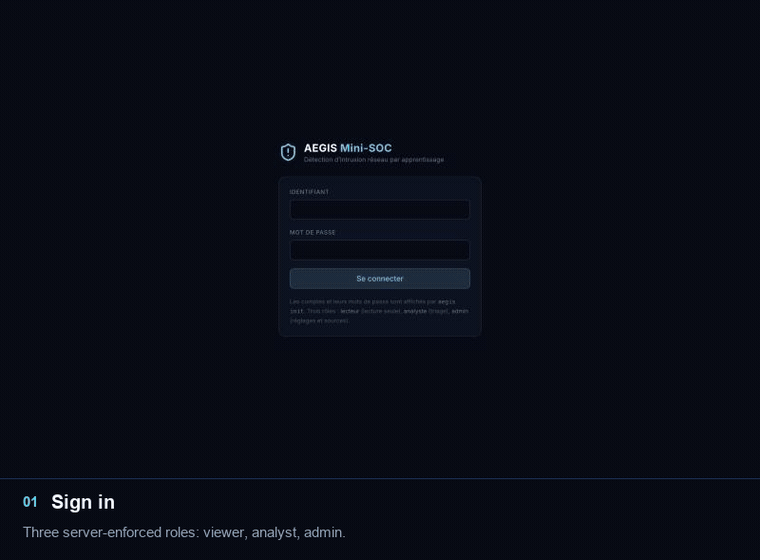

<table>
<tr>
<td width="50%">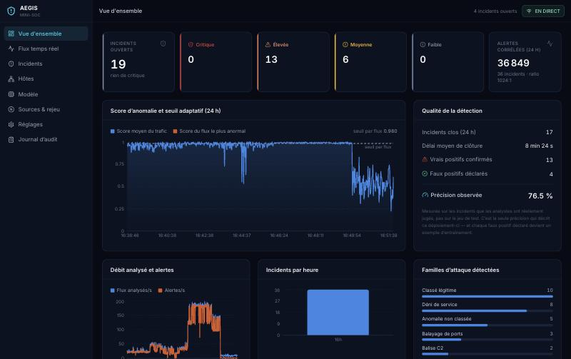</td>
<td width="50%">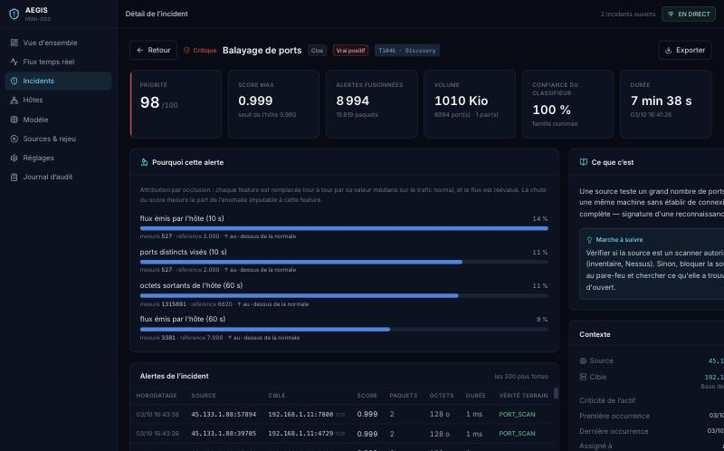</td>
</tr>
<tr>
<td><b>Ce qui se passe maintenant</b><br><sub>Gravités, score d'anomalie sur 24 h, et la précision réellement observée sur les incidents que les analystes ont jugés.</sub></td>
<td><b>Pourquoi cette alerte</b><br><sub>Chaque feature est remplacée par sa valeur normale et le flux réévalué : la chute du score dit ce qui a déclenché l'alerte.</sub></td>
</tr>
<tr>
<td>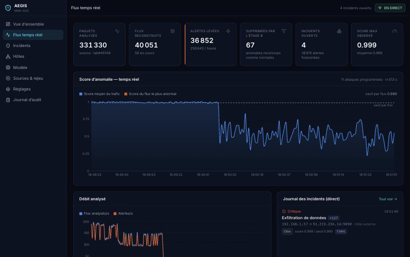</td>
<td>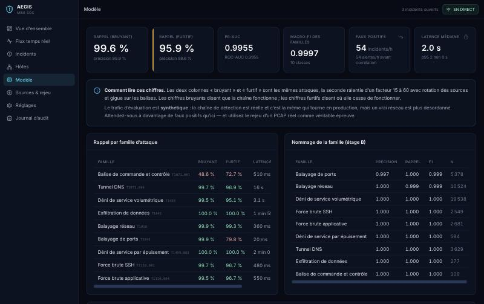</td>
</tr>
<tr>
<td><b>Le moteur en direct</b><br><sub>Compteurs et journal d'incidents poussés par WebSocket, y compris les alertes que l'étage B a supprimées.</sub></td>
<td><b>Ce que le modèle vaut vraiment</b><br><sub>Deux colonnes, attaques bruyantes et furtives, affichées dans le produit — y compris la famille qu'il rate.</sub></td>
</tr>
</table>

## Pourquoi c'est intéressant

Un antivirus réseau classique reconnaît une attaque parce qu'il en a déjà vu l'empreinte exacte. Il est donc aveugle à tout ce qui n'a pas encore été catalogué. Apprendre la normale plutôt que mémoriser des signatures permet d'attraper l'inconnu — mais pose quatre questions que la plupart des projets de ce type laissent ouvertes :

- **Un score d'anomalie, ça veut dire quoi ?** « 0,87 » n'est ni grand ni petit tant qu'on ne sait pas à quoi le comparer. Ici le score passe par la fonction de répartition du trafic bénin : **0,97 se lit « plus inhabituel que 97 % du trafic normal connu »**. Un seuil sur ce nombre a enfin un sens.
- **Comment un seul seuil pourrait convenir à toutes les machines ?** Un serveur de sauvegarde qui parle à douze hôtes à 3 h du matin et le portable de l'accueil n'ont pas la même normale. Chaque hôte tire donc son seuil du **quantile de son propre historique**, au-dessus d'un plancher commun.
- **Que faire quand une inondation lève mille alertes par minute ?** Les regrouper selon la **forme** de l'attaque. Mesuré en direct : **8 994 alertes deviennent un incident**.
- **Pourquoi un analyste devrait-il croire la machine ?** Chaque incident affiche les features qui l'ont déclenché, chiffres à l'appui : *répétitions vers une même cible — mesuré 197, référence 2*.

## Architecture

<picture>
  <source media="(prefers-color-scheme: dark)" srcset="docs/architecture-dark.svg">
  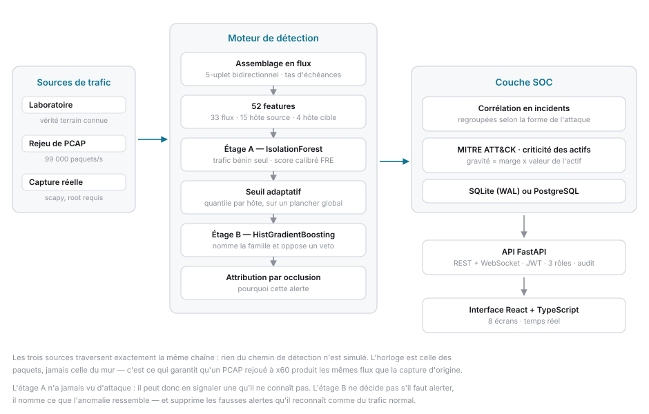
</picture>

Le **laboratoire**, le **rejeu de PCAP** et la **capture réelle** traversent exactement la même chaîne : rien du chemin de détection n'est simulé. L'horloge est celle des paquets, jamais celle du mur — c'est ce qui garantit qu'un PCAP rejoué à ×60 produit les mêmes flux que la capture d'origine.

Les deux étages ne font pas le même métier. **L'étage A n'a jamais vu d'attaque** : entraîné sur du trafic bénin seul, il peut donc en signaler une qu'il ne connaît pas. **L'étage B ne décide pas s'il faut alerter** : il nomme ce que l'anomalie ressemble, et oppose son veto quand il reconnaît du trafic normal.

## Le cycle de vie d'un flux

<picture>
  <source media="(prefers-color-scheme: dark)" srcset="docs/cycle-de-vie-dark.svg">
  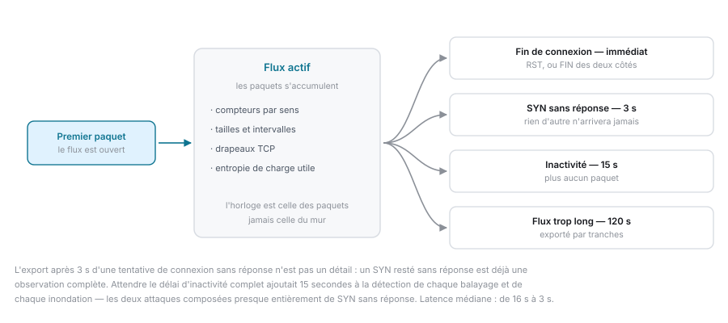
</picture>

## Ce qu'il détecte

| Famille | MITRE | Ce qui la trahit | Rappel |
|---|---|---|---|
| Exfiltration de données | `T1041` | ratio sortant/entrant inversé, port inhabituel | 100 % |
| Déni de service par épuisement | `T1499.003` | durée très longue, charge utile minuscule | 100 % |
| Balayage réseau | `T1018` | éventail de destinations sur 445, 22, 3389 | 99,9 % |
| Balayage de ports | `T1046` | éventail de ports, aucune poignée de main aboutie | 99,9 % |
| Force brute SSH | `T1110.001` | connexions complètes puis coupées, en rafale | 99,7 % |
| Tunnel DNS | `T1071.004` | requêtes DNS volumineuses à forte entropie | 99,7 % |
| Déni de service volumétrique | `T1498` | SYN/s côté victime, sources nombreuses | 99,5 % |
| Force brute applicative | `T1110.004` | requêtes POST quasi identiques et répétitives | 99,5 % |
| **Balise de commande et contrôle** | `T1071.001` | **régularité horaire** | **48,6 %** |

Neuf familles, chacune associée à sa technique MITRE ATT&CK et à une marche à suivre affichée dans l'incident.

## Sous le capot

<details>
<summary><b>Un seuil par hôte — et pourquoi la règle classique a échoué</b></summary>

<picture>
  <source media="(prefers-color-scheme: dark)" srcset="docs/seuil-dark.svg">
  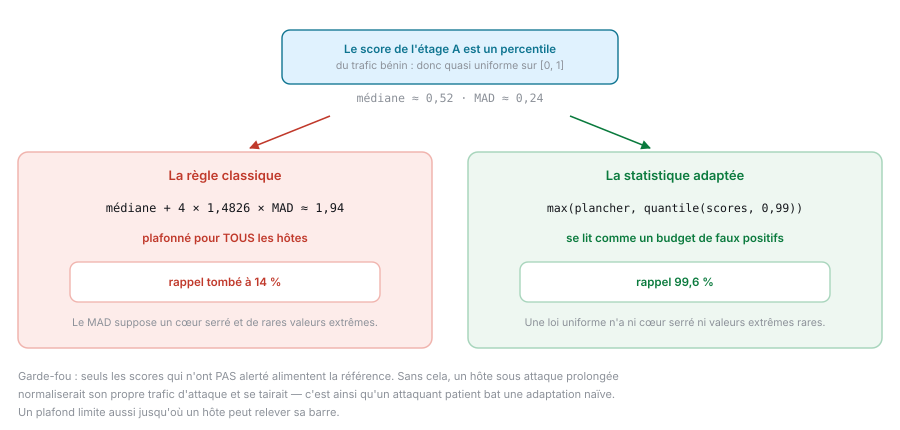
</picture>

La première version utilisait la règle robuste de manuel, `médiane + k·MAD`. Mesurée, elle a **détruit le rappel — tombé à 14 %**.

La raison tient en une phrase : les scores de l'étage A sont **déjà** la fonction de répartition du trafic bénin, donc quasi uniformes sur `[0, 1]`. La médiane vaut ~0,52, le MAD ~0,24, et `0,52 + 4 × 1,4826 × 0,24 ≈ 1,94` saturait au plafond pour **tous** les hôtes. Le MAD suppose une distribution à cœur serré avec de rares valeurs extrêmes ; une loi uniforme n'a ni l'un ni l'autre.

Dans un espace de percentiles, la statistique qui a un sens est un **quantile des scores de l'hôte**, et elle se lit directement comme un budget de faux positifs : « alerter sur le 1 % le plus inhabituel de cet hôte, jamais en dessous du plancher global ».

Deux garde-fous. Seuls les scores qui **n'ont pas** alerté alimentent la référence — sinon un hôte sous attaque prolongée normaliserait son propre trafic d'attaque et se tairait, exactement la manière dont un attaquant patient bat une adaptation naïve. Et un plafond limite jusqu'où un hôte peut relever sa propre barre.
</details>

<details>
<summary><b>La cascade : comment diviser les faux positifs par six</b></summary>

<picture>
  <source media="(prefers-color-scheme: dark)" srcset="docs/cascade-dark.svg">
  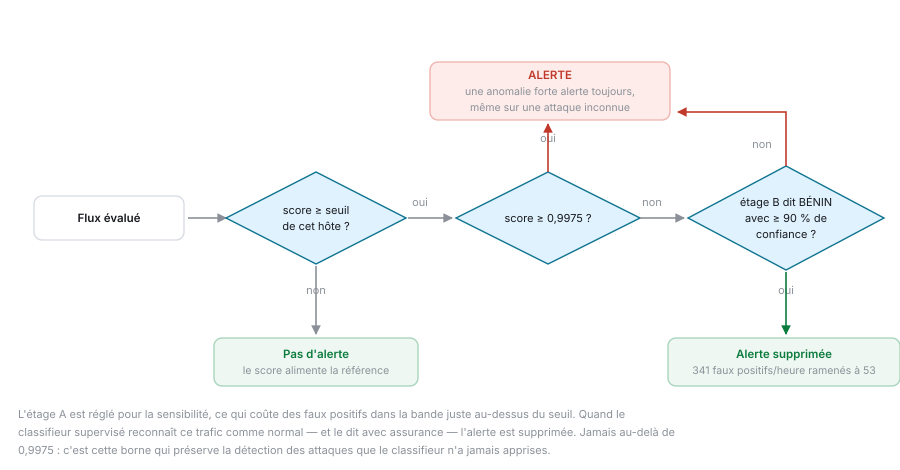
</picture>

L'étage A est réglé pour la sensibilité, ce qui coûte des faux positifs dans la bande juste au-dessus du seuil. L'étage B, lui, reconnaissait déjà ce trafic comme normal — mais son avis était ignoré, puisqu'il n'intervenait qu'après la décision d'alerter.

Désormais : quand l'étage A signale un flux **marginal** que l'étage B reconnaît comme normal avec au moins 90 % de confiance, l'alerte est supprimée. Jamais au-dessus de 0,9975, où une anomalie forte alerte toujours quoi qu'en dise le classifieur — c'est cette borne qui préserve la détection des attaques jamais apprises.

**Mesuré : 341 → 53 faux positifs par heure**, au prix de 0,6 point de rappel sur les attaques furtives.
</details>

<details>
<summary><b>Corréler, parce qu'un SOC noyé ne lit plus rien</b></summary>

<picture>
  <source media="(prefers-color-scheme: dark)" srcset="docs/correlation-dark.svg">
  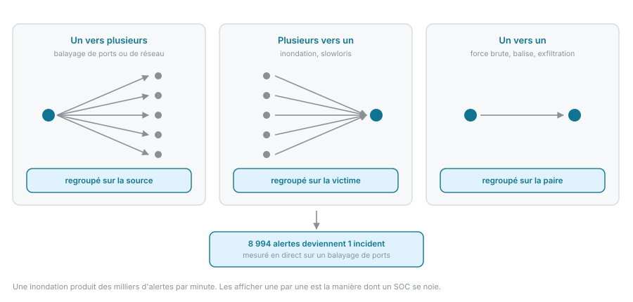
</picture>

La clé de regroupement dépend de la **forme** de l'attaque, pas d'une règle unique : un balayage se regroupe sur sa source, une inondation sur sa victime, une force brute sur la paire.

La gravité n'est pas le score. C'est la marge au-dessus du seuil **de cet hôte**, pondérée par ce que vaut l'actif visé et par la confiance du classifieur. Un balayage de ports contre le serveur de base de données passe donc devant un balayage plus bruyant contre une imprimante.
</details>

<details>
<summary><b>52 features, et une absence volontaire</b></summary>

| Groupe | Nombre | Exemples |
|---|---|---|
| Intrinsèques au flux | 33 | durée, paquets/s, octets/s, ratio aller/retour, moyenne et écart-type des tailles, intervalles entre paquets, drapeaux TCP, entropie de la charge utile |
| Comportement de la source (10 s / 60 s) | 15 | destinations et ports distincts, SYN/s sans établissement, part de connexions échouées, ratio sortant/entrant, **régularité de type balise** |
| Comportement de la cible (10 s) | 4 | flux reçus, sources distinctes, SYN/s non établis |

Les quatre dernières méritent leur existence : **une inondation aux sources usurpées est invisible côté source**, puisque chaque adresse falsifiée n'envoie qu'un paquet. Seule l'agrégation sur la victime la rend visible.

Le **numéro de port de destination brut n'est pas une feature**. Un modèle à arbres mémoriserait les ports du laboratoire (22, 80, 53…) et afficherait d'excellents scores sans aucun rapport avec sa capacité à généraliser. Seules les propriétés structurelles du port sont conservées.
</details>

<details>
<summary><b>Expliquer une alerte sans dépendance supplémentaire</b></summary>

Chaque feature est remplacée tour à tour par sa valeur médiane sur le trafic normal, et le flux est réévalué. La chute du score mesure la part de l'anomalie imputable à cette feature. C'est l'intuition que SHAP formalise, calculée exactement pour les sous-ensembles à une feature, en un seul appel vectorisé.

Le coût est maîtrisé par un budget : une inondation peut lever des centaines d'alertes par seconde, et les expliquer toutes dominerait la boucle sans aucun bénéfice puisqu'elles sont fusionnées en un seul incident. L'incident conserve l'explication de son alerte la plus forte.

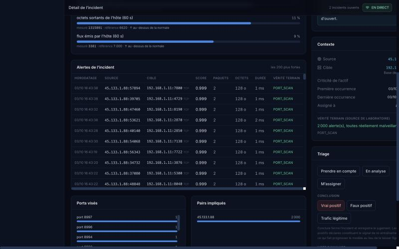
</details>

<details>
<summary><b>Trois sources, un seul moteur</b></summary>

| Source | Commande | Usage |
|---|---|---|
| Réseau de laboratoire | `make demo` | démonstration reproductible, vérité terrain connue |
| Rejeu de PCAP | `aegis replay capture.pcap --speed 20` | la véritable épreuve |
| Capture réelle | `sudo aegis capture en0` | déploiement (root requis) |

Pour fabriquer une capture de test sans rien télécharger :

```bash
aegis export-pcap --duration 300        # écrit data/pcaps/lab-<graine>-300s.pcap
aegis replay lab-2026-300s.pcap --speed 20
```

Le fichier s'ouvre dans Wireshark. Le rejeu reproduit **à l'identique** les features structurelles de la génération en direct — 5-uplet, paquets, octets, entropie et éventail de ports exacts à 100 %, vérifié par un test. Seuls les horodatages subissent la quantification à la microseconde propre au format pcap.

Le décodage se fait par un lecteur direct en `struct` : scapy plafonnait à 3 200 paquets/s, ce qui imposait cinq minutes d'attente sur une capture d'un million de paquets. **99 000 paquets/s** désormais, scapy restant le repli pour les types de liaison exotiques.
</details>

## Ce que le modèle vaut

Chiffres régénérés à chaque entraînement dans **[docs/BENCHMARK.md](docs/BENCHMARK.md)** : la documentation ne peut pas décrire un autre modèle que celui présent sur le disque.

| Mesure | Attaques bruyantes | Attaques furtives |
|---|---|---|
| **Rappel** | **99,56 %** | **95,94 %** |
| **Précision** | 99,89 % | 98,57 % |
| PR-AUC | 0,9955 | 0,9373 |
| Latence médiane de détection | 2,0 s | 6,0 s |

- **54 incidents de faux positifs par heure** sur du trafic ne contenant aucune attaque
- **macro-F1 0,9997** pour le nommage de la famille
- **~30 000 paquets/s** en mono-processus

### Pourquoi deux colonnes

Les variantes « furtives » sont les mêmes attaques ralenties d'un facteur 15 à 60, avec rotation des sources, variation des tailles de requête et gigue de 25 % sur les balises. Les chiffres bruyants disent que la chaîne fonctionne ; **les chiffres furtifs disent où elle cesse de fonctionner**.

### Le chiffre dont je suis le plus satisfait

**48,6 % de rappel sur la balise de commande et contrôle.** Pas parce qu'il est bon : parce qu'il est publié à côté des 99 % des huit autres familles.

Une balise émet peu — quelques centaines d'octets toutes les dizaines de secondes, poignée de main complète, vers un port banal. Pris isolément, chacun de ses flux ressemble à une requête web ordinaire, et c'est exactement ce que cherche un implant. Seule la **périodicité** la trahit, et cette régularité n'apparaît qu'après plusieurs contacts.

Un rapport qui n'afficherait que des 99,9 % partout n'aurait pas mesuré un détecteur : il aurait mesuré son propre générateur de trafic.

### Le protocole, puisque c'est lui qui donne du sens aux chiffres

1. L'étage A n'est entraîné que sur du **trafic bénin** — il ne voit jamais d'attaque.
2. La séparation train/test se fait **par capture**, jamais par ligne. Des flux issus de la même rafale d'attaque sont très corrélés : un découpage aléatoire produirait les 99,9 % illusoires dont ce type de projet est coutumier.
3. Le point de fonctionnement est mesuré en **rejouant les captures de test dans le moteur réel**, seuils adaptatifs compris, préchauffés sur une capture bénigne comme le serait une sonde déployée.
4. Les faux positifs sont mesurés sur des captures **sans aucune attaque** : la précision sur une capture riche en attaques flatte n'importe quel détecteur.
5. La latence est comptée du début de la fenêtre d'attaque à la première alerte, **délai d'export des flux inclus** — parce que ce délai est réel.

## Tout essayer en une commande

```bash
git clone https://github.com/aziz3r/aegis-mini-soc.git && cd aegis-mini-soc
./scripts/demo.sh
```

Le script installe ce qui manque, entraîne le modèle s'il n'existe pas encore (~6 minutes, une seule fois), crée la base et les comptes, puis démarre l'API avec le réseau de laboratoire déjà en marche. L'interface est sur **<http://127.0.0.1:8000>** ; les identifiants s'affichent pendant la création de la base.

**Aucune dépendance système** : pas de Docker, pas de serveur de base de données, pas de root — sauf pour la capture d'une interface réelle, qui en exige par nature. Si le port 8000 est pris, le script le dit et propose `AEGIS_PORT=8001 ./scripts/demo.sh`.

<details>
<summary>Étape par étape</summary>

```bash
make setup     # environnement Python + dépendances npm
make train     # entraîne les deux étages, régénère docs/BENCHMARK.md  (~6 min)
make build     # compile l'interface web
make init      # base de données et comptes (affiche les mots de passe)
make demo      # API + interface + réseau de laboratoire démarré
```

Trois rôles, vérifiés côté serveur : **lecteur** (consultation), **analyste** (triage), **admin** (réglages et sources).
</details>

## Ce qui empêche le projet de se dégrader

```bash
make test        # suite complète
make test-fast   # sans les tests qui entraînent un modèle
make lint        # TypeScript strict
```

**94 tests.** Ce ne sont pas des tests de façade :

| Ce qui est vérifié | Pourquoi ça compte |
|---|---|
| L'expiration optimisée est **équivalente au parcours naïf** sur 240 s de trafic mixte | Une optimisation non prouvée est un bug qui attend |
| Le calibrateur **retrouve la loi normale** à ±0,01 | Si la calibration ment, le seuil ne veut plus rien dire |
| 5 000 scores alertants ne déplacent **pas** le seuil d'un hôte | Le garde-fou de la grenouille ébouillantée |
| Un balayage → 1 incident, une inondation → 1 incident, deux forces brutes → 2 incidents | La corrélation suit bien la forme de l'attaque |
| L'aller-retour PCAP est **octet pour octet** | Sinon aucun chiffre mesuré sur capture ne décrirait le système déployé |
| Le **vrai** chemin d'écriture en base | Un bug y vivait, et aucun test unitaire ne l'aurait vu |

Les schémas sont eux aussi vérifiés : `python3 docs/schemas/tout.py` les régénère et refuse qu'un texte déborde de sa toile.

## Structure du dépôt

```
backend/aegis/
  core/       assemblage de flux, features, fenêtres glissantes, moteur,
              corrélation, actifs, correspondance MITRE
  ml/         jeu de données, modèle, calibration, seuil, entraînement
  sources/    réseau de laboratoire, lecture et écriture PCAP, capture live
  api/        FastAPI, WebSocket, authentification, pipeline temps réel
  store/      schéma SQLAlchemy, écriture par lots
  tests/      94 tests
frontend/src/
  pages/      vue d'ensemble, direct, incidents, hôtes, modèle, sources, réglages, audit
  components/ charte graphique et graphiques
docs/
  BENCHMARK.md   généré par « aegis train » — les chiffres du modèle sur le disque
  ARCHITECTURE.md  les décisions de conception et leurs raisons
  DECISIONS.md     les bugs qui ont changé le système, et ce qu'ils ont appris
  GUIDE_DEMO.md    quoi montrer, dans quel ordre, et quoi répondre
  schemas/         engendre les SVG clairs et sombres
rapport/        rapport de projet et dossier technique (LaTeX + PDF)
scripts/        demo.sh, fabrication de la démo et des PDF
.github/        intégration continue (5 travaux)
CONTRIBUTING.md stratégie de branches et contrôles avant une fusion
```

## Choses apprises en chemin

Quelques problèmes qui ont demandé de creuser, et ce qu'ils ont appris. Le détail complet est dans **[docs/DECISIONS.md](docs/DECISIONS.md)**.

- **Une statistique robuste ne l'est que pour la forme de distribution qu'elle suppose.** Le `médiane + k·MAD` appliqué à des percentiles saturait au plafond pour tous les hôtes, et faisait tomber le rappel à 14 %.
- **Un classifieur qu'on n'écoute qu'à la fin ne sert qu'à moitié.** L'étage B reconnaissait déjà les faux positifs ; lui donner un droit de veto les a divisés par six.
- **Une optimisation s'effondre souvent là où on en a le plus besoin.** Le parcours des flux actifs à chaque paquet tenait très bien… sauf pendant une inondation ou un slowloris, dont le principe même est d'ouvrir des milliers de connexions simultanées.
- **Un SYN sans réponse est déjà une observation complète.** L'attendre quinze secondes de plus ajoutait ce délai à la détection de chaque balayage.
- **Une latence se mesure au moment où l'information devient disponible**, pas au dernier paquet observé. Le chiffre publié est passé de 0,67 s à 3,0 s : le système n'a pas ralenti, la mesure est devenue vraie.
- **Un générateur qui ne sort jamais de la mémoire peut produire l'impossible.** Des trames déclaraient 206 octets tout en en transportant 256 ; personne ne s'en plaignait jusqu'à ce qu'il faille les écrire dans un vrai fichier pcap.
- **`os.urandom` casse la reproductibilité sans prévenir.** Même graine, mêmes flux, octets différents selon le processus — et toute vérification du rejeu devenait impossible.
- **SQLAlchemy applique les valeurs par défaut à l'INSERT**, pas à la construction de l'objet. Une ligne fraîchement créée contenait encore `None`, et le premier `+=` tuait la tâche d'ingestion — silencieusement, puisque l'exception était rangée dans l'état du pipeline.
- **Un graphique collé à son plafond apprend à l'opérateur à ne plus le regarder.** Le score maximum par seconde dépassait 0,95 dans 58 % des secondes sans que rien ne se passe : c'est la moyenne qu'il fallait tracer.
- **`index.html` est le seul fichier dont le nom ne change jamais.** Servi avec un cache par défaut, il épinglait le navigateur sur l'ancien build : l'application continuait d'exécuter du code périmé après chaque déploiement.

## Limites assumées

- **Le trafic d'évaluation est synthétique.** La chaîne de détection est réelle et c'est exactement la même qui tourne en production ; le trafic qui l'alimente est généré. Un vrai réseau est plus désordonné : attendez-vous à davantage de faux positifs. Le rejeu d'un PCAP réel est la véritable épreuve, et le système est construit pour.
- **Les familles sont séparables par construction**, ce qui explique le macro-F1 très élevé de l'étage B sur les variantes bruyantes. La colonne furtive est la mesure honnête.
- **La capture live n'a jamais été exercée.** Le code existe et sa gestion de contre-pression est testée, mais l'accès BPF exige les privilèges root, qui n'ont pas été utilisés.
- **Détection par flux, pas par paquet** : la latence inclut le délai d'export. C'est le compromis inhérent, et il est mesuré plutôt que passé sous silence.
- **Sonde unique**, pas d'agrégation multi-capteurs ; **pas d'inspection applicative** (TLS, HTTP) : seules les métadonnées comptent.

### Une nuance qui mérite d'être relevée

La précision au niveau des **flux** est de 99,89 %, mais la précision au niveau des **incidents**, telle que jugée par les analystes dans l'interface, tourne autour de **76 %**. Ce n'est pas une contradiction : les faux positifs ne fusionnent jamais — chacun constitue son propre incident — alors qu'une vraie attaque fusionne des milliers d'alertes en une seule ligne. Le tableau de bord affiche la valeur jugée par l'analyste, parce que c'est celle qui décrit la charge de travail réelle.

## Documentation

| Document | Contenu |
|---|---|
| **[rapport/dossier_technique.pdf](rapport/dossier_technique.pdf)** | Le dossier complet : contexte, conception, mesures, limites |
| **[rapport/rapport_projet.pdf](rapport/rapport_projet.pdf)** | La synthèse courte, avec captures |
| [docs/BENCHMARK.md](docs/BENCHMARK.md) | Les chiffres du modèle actuellement sur le disque, régénérés à chaque entraînement |
| [docs/ARCHITECTURE.md](docs/ARCHITECTURE.md) | Les décisions de conception et leurs raisons |
| [docs/DECISIONS.md](docs/DECISIONS.md) | Les bugs qui ont changé le système |
| [docs/GUIDE_DEMO.md](docs/GUIDE_DEMO.md) | Quoi montrer, dans quel ordre, et quoi répondre |

---

<sub>Réalisé seul. Le but n'était pas d'obtenir un score élevé sur un jeu de données public, mais de construire la chaîne complète — capture, features, modèle, calibration, seuils, corrélation, interface de triage — et de la mesurer honnêtement, y compris là où elle échoue.</sub>
